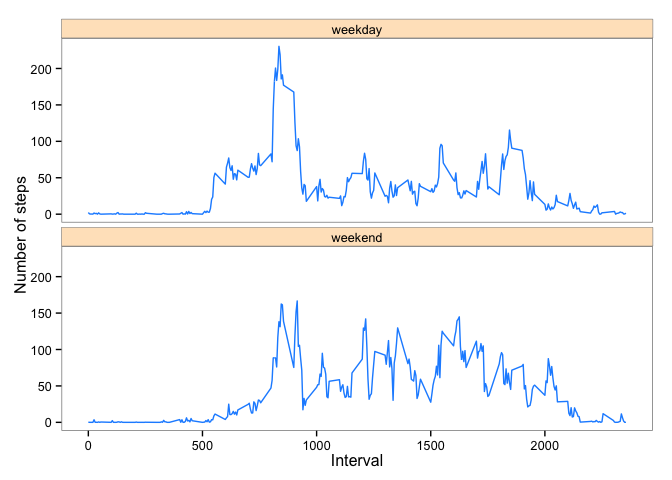

# Reproducible Research: Peer Assessment 1


## Loading and preprocessing the data

```r
dat <- read.csv("/Users/North_Point/Dropbox/MOOC/Data_Science/Reporducible Research/RepData_PeerAssessment1/activity.csv")
dat <- transform(dat, Date = factor(date), Interval = factor(interval))
```


## What is mean total number of steps taken per day?

```r
dat$sum_of_steps_per_day <- ave(dat$steps, dat$Date, FUN = sum)
library(ggplot2)
qplot(sum_of_steps_per_day, data = dat)
```

```
## stat_bin: binwidth defaulted to range/30. Use 'binwidth = x' to adjust this.
```

 

```r
mean_of_total_steps_per_day = mean(unique(dat$sum_of_steps_per_day),na.rm = TRUE)
median_of_total_steps_per_day = median(unique(dat$sum_of_steps_per_day), na.rm = TRUE)
mean_of_total_steps_per_day
```

```
## [1] 10766.19
```

```r
median_of_total_steps_per_day
```

```
## [1] 10765
```

## What is the average daily activity pattern?

```r
library(plyr)
r1 <- ddply(dat, .(Interval), summarize, mean = mean(steps, na.rm = TRUE))
qplot(r1$Interval, r1$mean, type = "l")
```

 

```r
r1[which.max(r1$mean), "Interval"]
```

```
## [1] 835
## 288 Levels: 0 5 10 15 20 25 30 35 40 45 50 55 100 105 110 115 120 ... 2355
```

## Imputing missing values

```r
number_of_missing_value <- sum(is.na(dat$steps))
## Fill with mean value at that interval
new_dat <- dat
new_dat$Interval <- as.numeric(new_dat$Interval)
for(i in 1:nrow(new_dat)){
        if(is.na(new_dat[i, "steps"])){
                current_interval = new_dat[i, "Interval"]
                new_dat[i, "steps"] = r1[current_interval, "mean"]
        }
        
}
new_dat$sum_of_steps_per_day <- ave(new_dat$steps, new_dat$Date, FUN = sum)
library(ggplot2)
qplot(sum_of_steps_per_day, data = new_dat)
```

```
## stat_bin: binwidth defaulted to range/30. Use 'binwidth = x' to adjust this.
```

 

```r
new_mean_of_total_steps_per_day = mean(unique(new_dat$sum_of_steps_per_day),na.rm = TRUE)
new_median_of_total_steps_per_day = median(unique(new_dat$sum_of_steps_per_day), na.rm = TRUE)
new_mean_of_total_steps_per_day
```

```
## [1] 10766.19
```

```r
new_median_of_total_steps_per_day
```

```
## [1] 10765.59
```

#####Comment: Since I replace the missing value with the mean value for that 5-minute interval, the mean of total number of steps taken per day remains the same as previous estimate. But such imputation slightly increase the median of total number of steps taken per day, from 10765 to 10765.59. We can see such imputation might increase the estimate of total number of steps taken per day, but the effect will be different with different choice of imputation.


## Are there differences in activity patterns between weekdays and weekends?

```r
new_dat$date = as.Date(new_dat$date, "%Y-%m-%d")
library(timeDate)
new_dat$isweekday = isWeekday(new_dat$date, wday=1:5)
new_dat_weekday = subset(new_dat, new_dat$isweekday == TRUE)
new_dat_weekend = subset(new_dat, new_dat$isweekday == FALSE)
r2 <- ddply(new_dat_weekday, .(Interval), summarize, mean = mean(steps, na.rm = TRUE))
r3 <- ddply(new_dat_weekend, .(Interval), summarize, mean = mean(steps, na.rm = TRUE))
head(r2,20)
```

```
##    Interval       mean
## 1         1 2.25115304
## 2         2 0.44528302
## 3         3 0.17316562
## 4         4 0.19790356
## 5         5 0.09895178
## 6         6 1.59035639
## 7         7 0.69266247
## 8         8 1.13794549
## 9         9 0.00000000
## 10       10 1.79622642
## 11       11 0.39580713
## 12       12 0.01761006
## 13       13 0.42054507
## 14       14 0.09056604
## 15       15 0.19790356
## 16       16 0.44528302
## 17       17 0.00000000
## 18       18 1.45953878
## 19       19 2.22180294
## 20       20 0.02264151
```

```r
r2 <- transform(r2, Interval = dat[r2$Interval, "interval"], isweekday = "weekday")
r3 <- transform(r3, Interval = dat[r3$Interval, "interval"], isweekday = "weekend")
total <- rbind(r2,r3)
head(total)
```

```
##   Interval       mean isweekday
## 1        0 2.25115304   weekday
## 2        5 0.44528302   weekday
## 3       10 0.17316562   weekday
## 4       15 0.19790356   weekday
## 5       20 0.09895178   weekday
## 6       25 1.59035639   weekday
```

```r
qplot(Interval, mean, data = total, facets = isweekday ~ ., geom = "line")
```

 

```r
g <- ggplot(total, aes(Interval, mean))
g <- g + geom_line(colour = "dodgerblue1") + facet_wrap(~isweekday, nrow = 2) + labs(x = "Interval") + labs(y = "Number of steps")
 g <- g + theme_bw() + theme(panel.grid.major = element_blank(), panel.grid.minor = element_blank())
#g <- g + theme_classic()
g <- g + theme(strip.background = element_rect(fill = "bisque1"))
g
```

 
